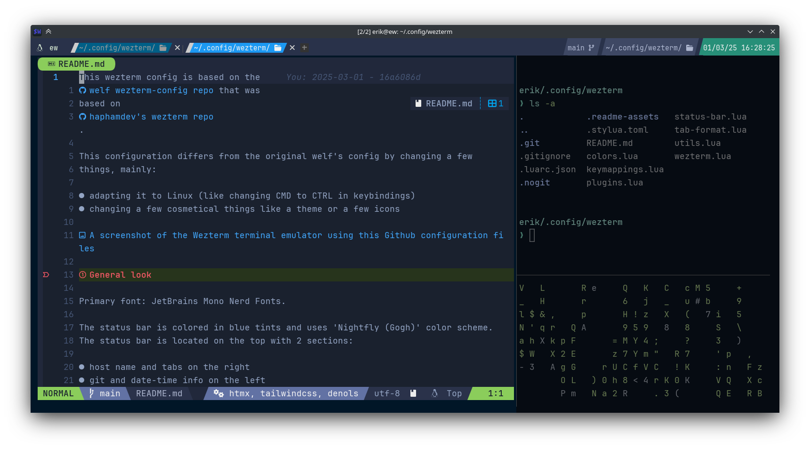

This wezterm config is based on the
[welf wezterm-config repo](https://github.com/welf/wezterm-config) that was
based on
[haphamdev's wezterm repo](https://github.com/haphamdev/dot-files/tree/master/wezterm).

This configuration differs from the original welf's config by changing a few
things, mainly:

- adapting it to Linux (like changing CMD to CTRL in keybindings)
- changing a few cosmetical things like a theme or a few icons

# General look

Primary font: JetBrains Mono Nerd Fonts.

The status bar is colored in blue tints and uses 'Nightfly (Gogh)' color scheme.
The status bar is located on the top with 2 sections:

- host name and tabs on the right
- git and date-time info on the left

## Tab bar description

The tab bar has support for tabs and lists:

- host name with an icon (in my case our beloved Tux penguin)
- tabs that can be renamed by pressing LEADER + r
- git branch widget
- current working directory widget
- date and time widget
- can be enabled battery charge level

# Shortcuts

## Shortcuts basics

**Leader**: CTRL + Space

Here the shortcuts tend to be Vim motions oriented. To configure the **leader
timeout** go to `keymappings.lua` and search for "timeout_milliseconds", the
default time is `3000 milliseconds`.

### General tab related shortcuts:

- Create new tab: Leader + t
- Exit tab: ALT + e

- Leader + `[, ]`: Move to the next/previous relative tab
- Leader + r: Rename current tab
- Leader + f: Find a word that you type in current tab

## Multiplexing

The config gives your terminal multiplexing capabilities using
[mrjones2014 smart-splits plugin](https://github.com/mrjones2014/smart-splits.nvim.git).
In this config you move through panes using Vim motions and you can split the
windows either vertically or horizontally.

### General multiplexing shortcuts:

- ALT + t: toggle left pane on/off
- Leader + `v, s`: Create a Vertical split or Split normally (horizontal split)
- CTRL + `h, j, k, l`: Move focus to up, down, left, right pane
- ALT + `h, j, k, l`: Resize active pane in a direction
